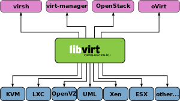

# QEMU-KVM as a Hypervisor

## Installation in short

```bash
# Target at 114.214.166.70
ROOT_DIR=/raid/workspace/qemu-kvm-imgs \
	sudo mkdir -p $ROOT_DIR && \
	sudo chown user:user -R $ROOT_DIR
sudo apt install qemu-kvm libvirt-bin virt-manager python-spice-client-gtk genisoimage
```

其中：

- /raid/workspace/qemu-kvm-imgs 用于保存虚拟机的 images；

- qemu-kvm 为 hypervisor，提供 qemu-img / qemu-system-x86_64 等程序；

- [libvirt](https://en.wikipedia.org/wiki/Libvirt) 为三方库，提供 hypervisor 的图形化管理工具。libvirt-bin 为 server 端程序，virt-manager 为 client 端程序。在 server 端，virt-manager 不用装，但此处我们装了（virt-manager 只支持 Linux，故此方法可方便 macOS 用户 X forward 一个 virt-manager）。python-spice-client-gtk 是为 virt-manager 提供 spice display 功能的拓展库。

  

## Tips on usage

- virt-manager 可添加多个 hypervisor；
- virt-manager 可方便创建虚拟机，virt-install 为 CLI 版；
- 所有的虚拟机镜像请安装在 /raid/workspace/qemu-kvm-imgs 目录下；
- server 上已安装 virt-manager，macOS 用户可直接 X forward 一个窗口来管理虚拟机；
- 创建虚拟机时记得开启 KVM 加速。
  - 命令 `kvm-ok` 可检测 kvm 是否 work。若 `lsmod | grep kvm` 只列出 kvm，而未列出 kvm_intel，则需要在 BIOS 中启用 intel-VT，然后重启即可。

